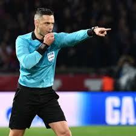

# Practica-Final
html lang="en">

<head>

<link rel="stylesheet" href="style.css">

    <title>Document</title>

</head>

<body>

  <H1>¿Como esta el futbol actualmente?</H1>

    

         

  

    

      
Hoy hablaremos sobre como va el futbol, hablaremos de todo.

  
  
          
Sobre las polemicas, el arbitraje, las ligas y la Champions League

    

   
  

        

  

  
Los principales culpables son

   
  
  
 

</body>

</html>
